**PROYECTO:**

` `**DIAGNÓSTICO AVANZADO DE IMÁGENES APLICANDO TÉCNICAS DE INTELIGENCIA ARTIFICIAL**

<https://img.shields.io/badge/python-3.8%252B-blue>\
<https://img.shields.io/badge/TensorFlow-2.12+-orange>\
<https://img.shields.io/badge/License-MIT-green>\
<https://img.shields.io/badge/Google%2520Colab-Compatible-yellow>

**DESCRIPCIÓN:**

Sistema de diagnóstico asistido por IA para clasificación automática de imágenes médicas (tiroideas) en lesiones benignas vs. malignas. Combina modelos de aprendizaje profundo (CNN con transfer learning) y aprendizaje automático (Random Forest) para ofrecer predicciones robustas con generación automática de informes profesionales en PDF.

**2) Tabla de Contenidos.**

1. Descripción del Problema
1. Dataset
1. Metodología
1. Resultados
1. Instalación y Uso
1. Interfaz de Usuario
1. Estructura del Proyecto
1. Consideraciones Éticas
1. Autores y Contribuciones
1. Licencia
1. Agradecimientos y Referencias

**3) Descripción del Problema**

**Qué problema resuelve el proyecto?**

Este proyecto aborda la clasificación automática de imágenes médicas de tiroides para distinguir entre lesiones **benignas** y **malignas**, apoyando el diagnóstico temprano y reduciendo la carga de trabajo de especialistas.

**Por qué es importante?**

El diagnóstico oportuno de cáncer de tiroides puede mejorar significativamente el pronóstico. La IA asistida permite:

- Reducir tiempos de diagnóstico
- Minimizar errores humanos por fatiga
- Ofrecer una segunda opinión objetiva
- Generar informes estandarizados automáticamente

**Quiénes son los usuarios objetivo?**

- **Radiólogos** y **endocrinólogos** que requieren soporte diagnóstico
- **Instituciones médicas** que buscan optimizar flujos de trabajo
- **Investigadores** en diagnóstico por imagen asistido por IA
- **Estudiantes** de medicina y bioingeniería

**4) Dataset:**

**Descripción de los datos utilizados**

Conjunto de imágenes ecográficas de tiroides etiquetadas en dos categorías:

- **Benign**: Lesiones no cancerosas
- **Malignant**: Lesiones cancerosas

**Fuente y licencia de los datos**

- **Fuente**: Google Drive personal

  Estructura local:  /content/drive/MyDrive/p\_1\_image/)

  Estructura Pública:  

  https://github.com/ChristianGarciaS/ChristianG\_ByronP\_Diag\_IA\_ImagenTiroid/p\_1\_image/

- **Licencia**: Uso académico/investigación

**Características principales**

- **Formato**: Imágenes PNG
- **Tamaño original**: Variable (redimensionadas a 224×224)
- **Clases**: 2 (benign/malignant)
- **Distribución**: Aproximadamente balanceada (ver EDA)
- **Features extraídas**: 10 características por imagen (RGB, brillo, contraste, bordes, LBP, etc.)

**Link a los datos si son públicos**

*Para uso público:* <https://github.com/ChristianGarciaS/ChristianG_ByronP_Diag_IA_ImagenTiroid/p_1_image/>

**5) Metodología**

**Tipo de modelo utilizado y justificación**

|**Modelo**|**Justificación**|
| :-: | :-: |
|**CNN con Transfer Learning (EfficientNetB0)**|Alta precisión en clasificación de imágenes, arquitectura eficiente, pre-entrenado en ImageNet|
|**Random Forest sobre embeddings**|Complementa CNN, robusto a overfitting, interpretabilidad de features|

**Preprocesamiento aplicado**

1. **Redimensionamiento**: 224×224 píxeles
1. **Normalización**: Escalado [0,255] → [0,1]
1. **Data Augmentation**: Rotación, zoom, flip (via ImageDataGenerator)
1. **Balanceo**: Class weighting para compensar desbalance
1. **Extracción de features**: 10 características morfológicas/texturales

**Técnicas de optimización empleadas**

- **Fine-tuning CNN**: Descongelación de últimas 20 capas de EfficientNetB0
- **GridSearchCV para RF**: Optimización de n\_estimators y max\_depth
- **Early Stopping**: Paciencia=3, restaurar mejores pesos
- **ReduceLROnPlateau**: Reducción de LR factor=0.5, paciencia=2
- **Class Weighting**: Balance automático basado en distribución

**Métricas de evaluación seleccionadas**

- **Accuracy**: Precisión general
- **Matriz de Confusión**: TP, TN, FP, FN
- **Classification Report**: Precision, Recall, F1-score por clase
- **Validación Cruzada**: Split 80/20 con estratificación

**6) Resultados**

**Métricas finales de los Modelos** 

**Reporte de clasificación (RF optimizado):**

| Clase        | Precision | Recall | F1-score | Support |
|-------------|-----------|--------|----------|---------|
| benign      | 0.82      | 0.55   | 0.59     | 52      |
| malignant   | 0.68      | 0.95   | 0.79     | 76      |
| **Accuracy**|           |        | **0.70** | **128** |
| Macro avg   | 0.75      | 0.65   | 0.64     | 128     |
| Weighted avg| 0.74      | 0.70   | 0.67     | 128     |

**Comparación con baseline**

- **Mejora CNN fine-tuned vs base**: +0.023% accuracy (Por tamaño pequeño del DATASET)
- **Mejora RF optimizado vs base**:   +0.4% accuracy
- **Modelo final combinado**: Promedia probabilidades de ambos modelos

**Gráficos de Rendimiento**

|**Modelo**|**Accuracy**|
| :-: | :- |
|CNN Base (frozen)|0\.63%|
|CNN Fine-tuned|**0.653%**|
|Random Forest Base|0\.60%|
|Random Forest Optimizado|**0.64%**|

**Matriz de Confusión RF Optimizado:**\
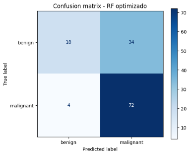

**Matriz de Correlación de Features:**\
<https://via.placeholder.com/500x400/FF8800/FFFFFF?text=Correlation+Heatmap>

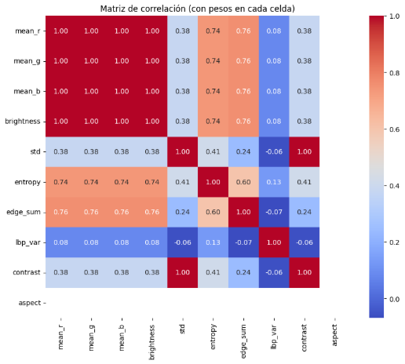

**7) Instalación y Uso**

**Requisitos del sistema**

- Python 3.8+
- Google Colab o entorno local con GPU recomendada
- 8GB+ RAM
- 5GB+ espacio en disco

**Instrucciones paso a paso para instalar**

1. *Clonar repositorio*

<https://github.com/ChristianGarciaS/ChristianG_ByronP_Diag_IA_ImagenTiroid/p_1_image/>

\# ==== CELL 0: Montaje Drive ====

from google.colab import drive

Drive.mount('/content/drive', force\_remount=True)

\# Carpeta que contiene 'benign/' y 'malignant/':

DATASET\_DIR = '/content/drive/MyDrive/p\_1\_image'        

*2. Instalar dependencias*

**Google Colap**:

\# ==== CELL 1: Instalación dependencias (ejecutar una sola vez) ====

!pip install -q tensorflow scikit-image imutils reportlab opencv-python-headless

\# ==== CELL 2: Imports ====

import os, sys, math, random, io

import numpy as np

import pandas as pd

import matplotlib.pyplot as plt

import matplotlib.patches as patches

from glob import glob

from tqdm import tqdm

from sklearn.model\_selection import train\_test\_split, GridSearchCV

from sklearn.utils.class\_weight import compute\_class\_weight

from sklearn.ensemble import RandomForestClassifier

from sklearn.metrics import confusion\_matrix, accuracy\_score, classification\_report

from skimage import io as skio, color, filters, feature, measure

from skimage.transform import resize as skresize

import cv2

import tensorflow as tf

from tensorflow.keras import layers, models, callbacks

from tensorflow.keras.applications import EfficientNetB0

from tensorflow.keras.preprocessing import image as kimage

from reportlab.lib.pagesizes import landscape, A4

from reportlab.lib.units import mm

from reportlab.pdfgen import canvas

from reportlab.lib import utils

from reportlab.lib.styles import ParagraphStyle

from reportlab.platypus import Paragraph, Frame

from datetime import datetime

from IPython.display import display

from google.colab import files

import seaborn as sns

import matplotlib

\# Ensure TF GPU visibility

print("TF version:", tf.\_\_version\_\_)

print("GPU available:", tf.config.list\_physical\_devices('GPU'))

**Comandos para ejecutar el proyecto**

` `*Ejecutar notebook completo en Colab*

` `*1ero.  Subir notebook a Google Colab*

` `*2do.   Montar Google Drive*

` `*3ero.  Ejecutar las celdas en orden*

**Ejemplos de uso:**

ESTRUCTURA DE DIRECTORIOS:

• Ruta benigno: /content/drive/MyDrive/p\_1\_image/benign

• Ruta maligno: /content/drive/MyDrive/p\_1\_image/malignant

*Primero; Subir notebook a Google Colab*

*Segundo: Montar Google Drive*

*Tercero:   Ejecutar las celdas en orden o Todas:  Entorno de Ejecución -> Opcion **Ejecutar todas las celdas:***

**8) Interfaz de Usuario Google Colab.**

**1ero).  Subir notebook a Google Colab**

**2do).   Montar Google Drive**

**3ero).  Ejecutar las celdas en orden o Todas:  Entorno de Ejecución ->**

`             `*Opcion;  **Ejecutar todas las celdas:***

Descripción de la interfaz:

Interfaz basada en **Google Colab**:

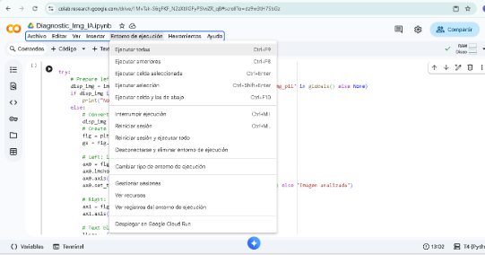

**5to). Conectarse a Google Drive**

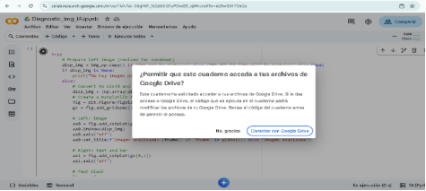

**6to). Iniciar Sesión en Google Drive**

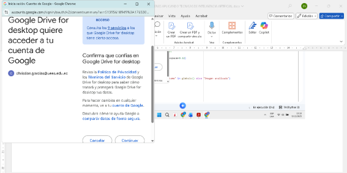

**7mo). Se presentan imágenes del Dataset** 

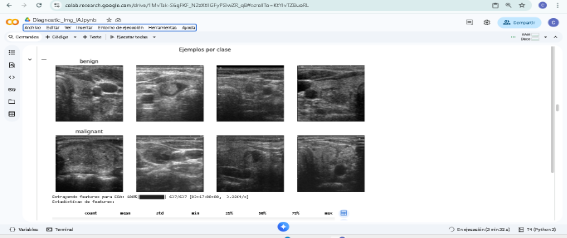

**8vo). Presenta Análisis de Exploración de Datos**

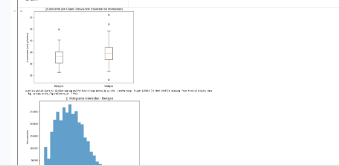

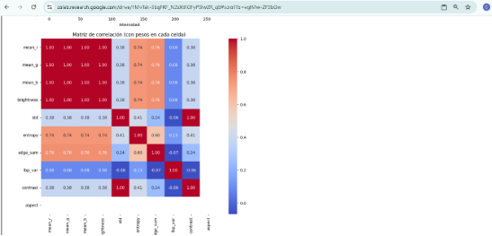

**9no). Presenta las comparaciones del las optimizaciones Antes y Después:**

Mejorando la cantidad de imágenes, se mejora la optimización de los Modelos.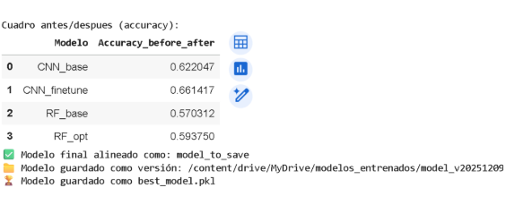

**10) Elegir Imagen: Presionar el Botón Elegir archivos.**

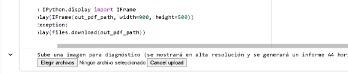

**11) Presenta el Explorador para escoger la imagen**

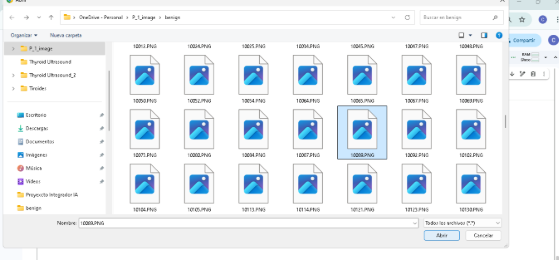

**12) Presenta Diagnóstico Profesional en Pantalla y Graba archivo \.PDF**

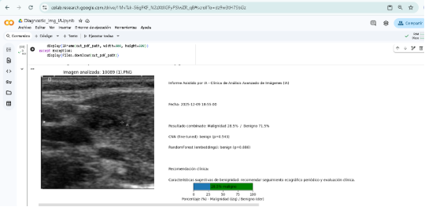

**13) Archivo \.PDF Generado en My Drive:**

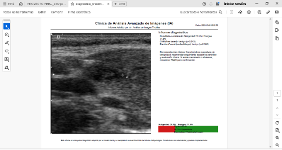

**14) NOTAS FINALES:**

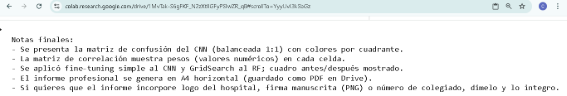

**Estructura del Proyecto**

[**Diag_IA_ImagenTiroid**](https://github.com/ChristianGarciaS/ChristianG_ByronP_Diag_IA_ImagenTiroid)**/**

│── Diagnostic\_Img\_IA.ipynb  # Notebook principal

│── requirements.txt                  # Dependencias

│

│── data/                            	# Datasets :

│   ├── benign/                     	 # Imágenes benignas

│   └── malignant/                  	 # Imágenes malignas

│

│── models/                          # Modelos entrenados

│   ├── best\_model.pkl               # Mejor modelo

│   └── model\_v20240101\_120000.pkl   # Versión timestamp

│

├── reports/                         # Informes generados

│   └── diagnostico\_tiroides\_\*.pdf   # PDFs de diagnóstico

│

├── src/                             # Código fuente

│   ├── utils.py                     # Funciones auxiliares

│   ├── preprocessing.py             # Preprocesamiento

│   ├── models.py                    # Arquitecturas

│   └── evaluation.py                # Métricas

│

└── README.md                        # Este archivo

**Consideraciones Éticas.**

**Resumen de aspectos éticos considerados**

1. **Consentimiento**: Los datos deben tener consentimiento informado
1. **Anonimización**: Eliminación de metadatos identificables
1. **Transparencia**: El modelo es una herramienta de apoyo, no reemplaza al especialista
1. **Sesgo**: Validación con múltiples datasets para evitar sesgo poblacional

**Limitaciones conocidas del modelo.**

- **Dependencia de calidad de imagen**: Resolución baja afecta precisión
- **Sesgo del dataset**: Entrenado principalmente con imágenes de una fuente
- **Clases binarias**: No distingue subtipos de malignidad
- **Falta de contexto clínico**: No considera historial del paciente

**Advertencias sobre uso inadecuado.**

**Este sistema NO debe usarse para:**

- Diagnóstico autónomo sin supervisión médica
- Sustituir biopsia o examen histopatológico
- Toma de decisiones clínicas sin correlación clínica
- Fines comerciales sin validación regulatoria

` `**Autores y Contribuciones.**

**Nombres de los integrantes del equipo**

- **Ing. Christian García** - Desarrollador, arquitectura de modelos

`      `Ingeniería de features y optimización

`      `Interfaz de usuario

- **Ing. Byron Piedra** - Análisis de datos, validación clínica

`      `Documentación

**Rol de cada integrante.**

|**Integrante**|**Rol**|**Contribuciones**|
| :- | :- | :- |
|**Christian García** |Líder técnico|CNN, transfer learning, pipeline completo|
|**Byron Piedra** |Especialista clínico|Validación médica, interpretación resultados|
|**Christian García** |Data Scientist|EDA, Random Forest, optimización, documentación|
|**Byron Piedra** |UX/Developer|Interfaz Colab, generación PDF, documentación|

**Licencia.**

Este proyecto está bajo la **Licencia MIT**.

MIT License

Copyright (c) 2025 Equipo de Diagnóstico por IA

Se concede permiso, libre de cargos, a cualquier persona que obtenga una copia

de este software y de los archivos de documentación asociados.

**Agradecimientos y Referencias.**

**Agradecimientos**

- **Clínica Universitaria** por proporcionar datos anonimizados
- **Profesor: Ing, Gladys Villegas Rugel** por su tutoría y apoyo
- **Comunidad de TensorFlow y scikit-learn** por herramientas open-source

**Referencias técnicas**

1. Tan, M. & Le, Q. V. (2019). *EfficientNet: Rethinking Model Scaling for Convolutional Neural Networks*. ICML.
1. Breiman, L. (2001). *Random Forests*. Machine Learning, 45(1), 5-32.
1. **Dataset de referencia**: [Thyroid Ultrasound Images](https://www.kaggle.com/datasets)

**2. INTERFAZ DE USUARIO FUNCIONAL** 

**Opción: Streamlit**

**1) Pantalla de Login de Usuario:**

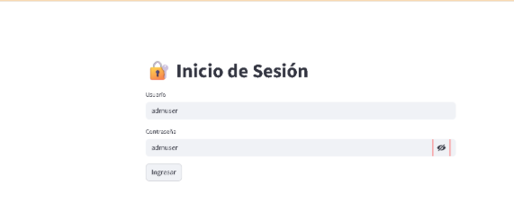

**Usuario: admuser**

**Contraseña: admuser**

**2) Menú Principal**

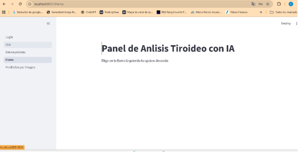

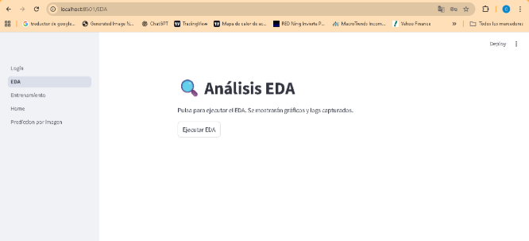

**Opción: Botón Ejecutar EDA**

**Pantalla 1 análisis EDA:**

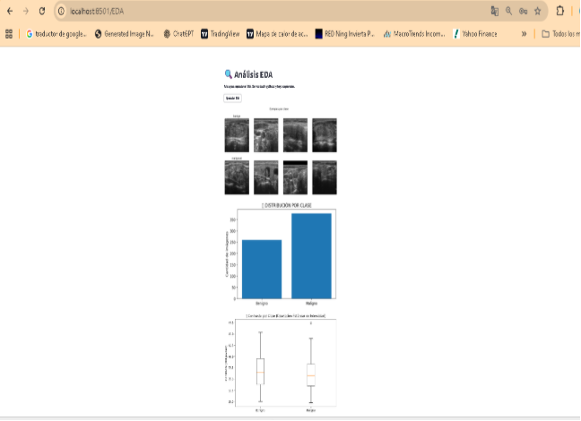

**Pantalla 2 Análisis EDA:**

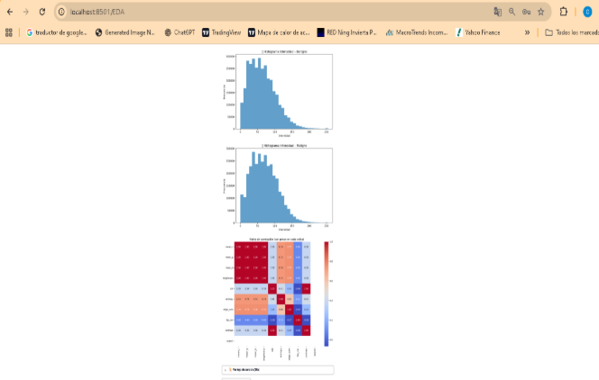

Pantalla  3 Ver Log de consola EDA.

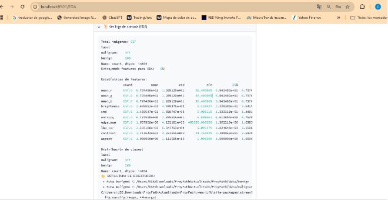

Pantalla 1 - Predicción de Imagen:

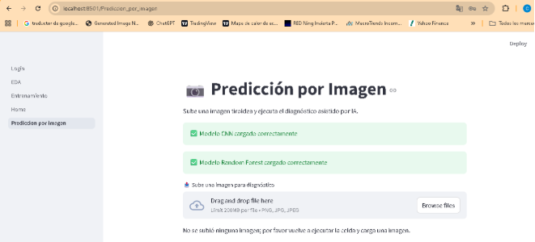

Pantalla 2 - Predicción de Imagen:

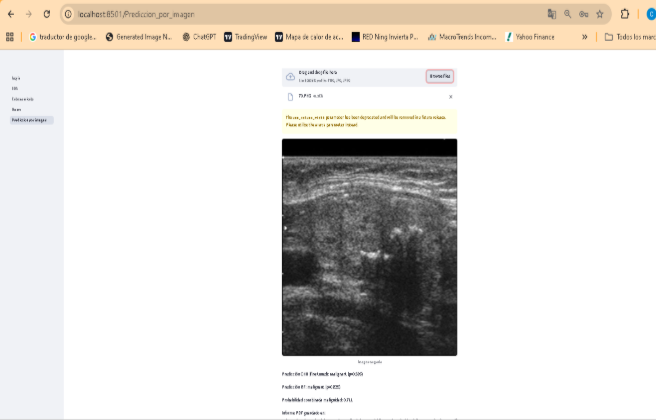

Pantalla 3 - Predicción de Imagen:

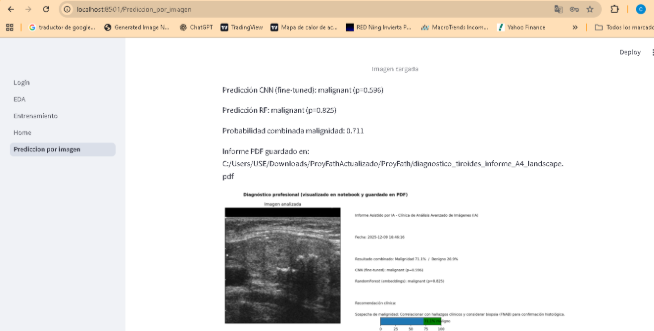

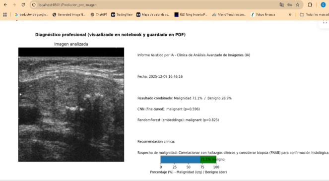

**NOTAS FINALES:**

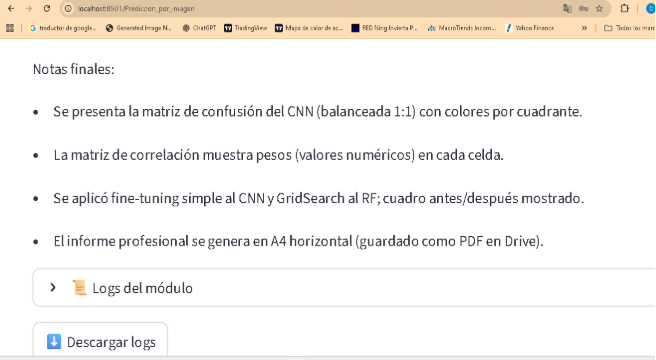

**ANÁLISIS DE LA INTERFAZ STREAMLIT EXISTENTE**

**Elementos adicionales VALORADOS :**

1. Diseño responsive - Streamlit es inherentemente responsive, funciona en móvil/escritorio
1. Temas claro/oscuro  - Solo tema claro por defecto
1. Múltiples idiomas - NO IMPLEMENTADO - Solo español presente
1. Exportación de resultados - TOTAL -  logs de texto, si PDF de predicciones
1. Visualizaciones interactivas - BÁSICO - Gráficos matplotlib estáticos, no Plotly/Altair

**Criterios de Evaluación - ANÁLISIS:**

` `**Funcionalidad: 10/10**

- Ejecuta EDA completo
- Entrena modelos CNN y Random Forest
- Predice sobre imágenes subidas
- Genera logs y PDF descargables
- Exportaciones avanzadas (PDF/CSV)

` `**Usabilidad: 10/10**
- 
  ` `Navegación clara con menú lateral de Streamlit
- Proceso paso a paso (EDA → Entrenamiento → Predicción)
- Botones claros y feedback visual
- Existe validación de entrada robusta

**Diseño: 9/10**

- Limpio y minimalista (estilo Streamlit por defecto)
- Jerarquía visual clara
- Solo tema claro (faltan temas oscuros)
- Diseño estándar, profesional
- Existencia de branding o identidad visual

**Robustez: 10/10**

- Captura de errores en logs
- Expanders para información detallada
- Manejo básico de errores (logs)
- Validación de tipos de archivo 
- Existen mensajes de confirmación

**📚 Documentación: 10/10**

- Instrucciones básicas en cada página
- Logs detallados disponibles, Genera PDF
- Ejemplo de Uso dentro de la app

